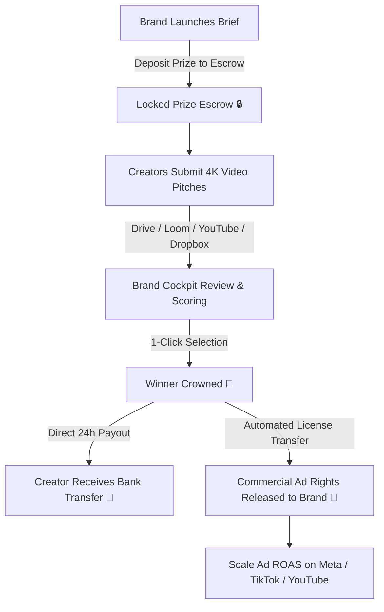

<div align="center">

# ⚡ BrandForge

### The Next-Gen UGC Video Pitching & Creator Marketplace Platform
**Where High-Growth D2C Brands & Top-Tier Video Creators Forge High-Converting Ad Content**

[](https://react.dev/)
[](https://vitejs.dev/)
[](https://tailwindcss.com/)
[](https://www.framer.com/motion/)
[](LICENSE)

[Live Demo](https://brand-forge-frontend.vercel.app) • [Features](#-core-features) • [Workflow](#-interactive-workflow) • [Architecture](#-component-architecture) • [Tech Stack](#-tech-stack) • [Getting Started](#-getting-started)

---

</div>

## 📖 Overview

**BrandForge** is an end-to-end UGC (User-Generated Content) video pitching platform that bridges high-growth direct-to-consumer (D2C) brands with skilled video creators and UGC artists. 

Traditional influencer marketing is plagued by endless back-and-forth emails, rigid contracts, unverified creators, and zero content guarantees before payment. BrandForge eliminates this friction by introducing an **escrow-backed contest & pitch model**:
- **Brands** launch hyper-targeted video briefs with guaranteed prize escrow pools.
- **Creators** stream raw uncompressed video pitches directly via Google Drive, YouTube, Loom, or Dropbox.
- **Brands crown winning concepts in 1-click**, instantly disbursing payouts to creators while unlocking full commercial usage rights for Meta, TikTok, and YouTube ads.

---

## ✨ Core Features

### 🏝️ iPhone Dynamic Island Navigation Bar
- **Floating Glassmorphic Pill Capsule**: Translucent white-glass capsule header with layered drop-shadows and spring-physics entry animations.
- **Gliding Indicator**: Smooth layout spring pill that glides seamlessly under the active navigation link.
- **Zero-Conflict Scroll Tracking**: Smooth section detection coupled with debounced programmatic scroll locks to eliminate jitter.
- **Mobile Responsive Drawer**: Expandable capsule dropdown with instant access to platform routes.

### 🎮 Dual-Role Interactive Live Simulator
- **Brand Cockpit Preview**:
  - Filter campaigns across `Approved` and `Pending Review` states.
  - Review incoming creator submissions with real-time metadata, platform sources, and star ratings.
  - **1-Click Winner Selection**: Interactive crowning simulation with dynamic particle confetti celebrations.
- **Creator Studio Preview**:
  - Direct video pitch submission cockpit supporting Google Drive, YouTube Unlisted, Loom, and Dropbox links.
  - Live upload simulation with validation and instant status feedback.

### 🛍️ Real-Time Campaign Explorer
- Dynamic campaign discovery directory categorized by industry:
  - 🌿 *Beauty & Wellness*
  - 🎒 *D2C Lifestyle*
  - ⚡ *Tech & SaaS*
  - 🍵 *Food & Beverage*
  - ⌚ *Fitness Tech*
- Visual urgency indicators, prize pool chips, deadline timers, and instant pitch submission triggers.

### 📜 ScrollStack Workflow Architecture
- Interactive 4-stage visual journey highlighting the lifecycle of a BrandForge campaign:
  1. **Brief Launch & Prize Escrow**: Set campaign hooks, visual guidelines, and deposit escrow funds.
  2. **4K Raw Video Pitching**: Creators submit high-resolution uncompressed video concepts.
  3. **Winner Crowning & Instant Payout**: 1-click winner selection with 24-hour direct payouts.
  4. **Ad ROAS Scale**: Plug winning creatives into Meta & TikTok ad pipelines with 3.4x average ROAS.

### 🧮 Interactive ROI & Value Estimator
- **Brand Mode**: Calculate agency cost savings, estimated video pitches, and ROI multiplier based on monthly creative budgets.
- **Creator Mode**: Estimate monthly earnings potential based on video pitches submitted per month and projected win rates.

---

## 🔄 Interactive Workflow

BrandForge operates on a frictionless 4-phase transaction and creative pipeline:



---

## 🏗️ Component Architecture

```
src/
├── App.jsx                     # Top-level Application Shell
├── main.jsx                    # Vite React 19 Entrypoint
├── index.css                   # Tailwind CSS v4 directives & custom utilities
├── config/
│   └── appUrls.js              # Production authentication & app redirection URLs
└── components/
    ├── Navbar.jsx              # Dynamic Island floating pill navigation with spring indicators
    ├── LandingPage.jsx         # Core landing page, interactive cockpit, marketplace & ROI calc
    ├── ScrollStackWorkflow.jsx # Sticky scroll-driven 4-phase workflow showcase with card stacking
    └── SectionDivider.jsx      # Gradient wave & ambient glow section transition dividers
```

---

## 🛠️ Tech Stack & Dependencies

| Category | Technology | Purpose |
| :--- | :--- | :--- |
| **Framework** | [React 19](https://react.dev/) | Core UI library utilizing modern hooks & concurrent rendering |
| **Build Tool** | [Vite 7](https://vitejs.dev/) | Lightning-fast HMR and optimized production bundling |
| **Styling** | [Tailwind CSS v4](https://tailwindcss.com/) | Modern utility-first CSS framework with `@tailwindcss/vite` |
| **Animations** | [Framer Motion 12](https://www.framer.com/motion/) | Spring physics, layout animations, gestures & scroll reveals |
| **Icons** | [Lucide React](https://lucide.dev/) | Modern, lightweight icon suite |
| **Interactivity** | [Canvas Confetti](https://www.npmjs.com/package/canvas-confetti) | High-performance canvas-based celebratory particle explosions |
| **Smooth Scroll** | [Lenis](https://lenis.darkroom.engineering/) | Kinetic smooth scroll engine for luxury feel |
| **Code Quality** | [ESLint 9](https://eslint.org/) | Modern flat configuration for React & React Hooks |
